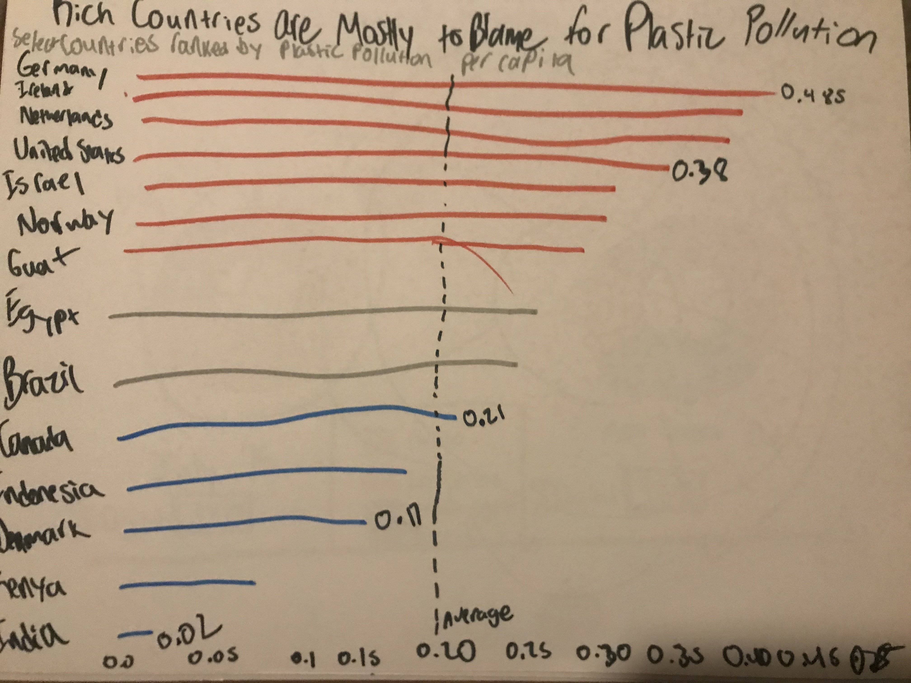

# tellingstorieswithdata

## About Me

I am a 2nd year MSPPM student who is very excited to learn more in this class! I use he/him pronouns. I'm not used to this style of schooling. I'm used to more policy focused courses and work, but I certainly need to branch out. I never thought I'd be the type of person who needs to make a GitHub. I'm also from Erie, PA. I love the city I'm from, and would suggest anyone in the Pittsburgh area should go up and visit for a day! 

## What I Hope to Learn

- How to frame data in the best way to tell the story I need to 
- The best use of colors possible
- How to use Tableau and other graphic-making platforms

# Portfolio

## Data Visualization 1
#### OECD data- Government Debt to GDP Ratio, 2017
All of this data comes from this original chart from the OECD itself-

<iframe src="https://data.oecd.org/chart/6sDW" width="850" height="638" style="border: 0" mozallowfullscreen="true" webkitallowfullscreen="true" allowfullscreen="true"><a href="https://data.oecd.org/chart/6sDW" target="_blank">OECD Chart: General government debt, Total, % of GDP, Annual, 2017</a></iframe>

#### Grid Chart of OECD data

#### Donut Chart of OECD data

Choosing the Donut Chart may be a bit silly, and a bit of a risk. Inherently, the Donut chart is similar to the pie chart and should be used as a part of a whole, which I do agree with. My goal was to have a form of data, not in bar-chart form (or another form adjacent to the line graph grid and bar charts, such as columns) that would show the sizes between the OECD countries. The goal isn't to tell a story with the source data, but in my donut chart I felt that the size and labels of the countries gave a size comparison in a way I most enjoyed in flourish. 

When it comes to the data listed in the first chart under the Data Visualization tab, the best way of viewing it is the first two things listed here. They accurately show the size of govt debt in a way that allows you to gather informaiton it wants you to know quickly. I'm understanding the positives and negatives of flourish. When withheld from all the options I'd be hoping for, it makes needing to choose a graphic more difficult. 

## Critique by Design 

#### My Chosen Data Visualization 
<iframe src="https://ourworldindata.org/grapher/plastic-waste-per-capita?tab=chart" loading="lazy" style="width: 100%; height: 600px; border: 0px none;"></iframe>

(I'm reworking the Map part of this visualization). I knew I wanted to focus on plastic pollution, and this map shows which countries are, per capita, the highest polluting countries. This map doesn't truly have any major faults. It was originally created by ourworldindata.org, which is nonpartisan. While plastic pollution is universally known as a bad thing, the urgency of the problem is disputed. The neutral coloring does not portray a strong story. This works for its original audience, but in my change I'm looking to give the reader ideas they can come away with. 

#### My Wireframe

My original thoughts were to portray that the countries up top were polluting at dangerous levels and deserve blame and public pressure. This is why I chose (obviously roughly) a red to blue gradient. I also knew I wanted to put an average line to help show where the world is currently at. Then, as per Step 4, I tested this on two subjects. The first subject is a college student focusing on education and the second is a retiree in their 70s, which I feel is a great test to know if this can be understood! 

My first subject said that the wireframe was something she found easy to understand. She felt that the title could have been more obviously a title and that it blended in with the rest of the graph too much. She also advocated that I change the color scheme, which I did end up listening to. The red to blue is fine, but I think it is wrong to insinuate low pollution levels are a good thing (insinuated by blue) when it is actually just a less bad thing (insinuated by lighter red). She also called me out for forgetting a label on the numbers.  

My second subject, the retiree, had a hard time understanding the wireframe. It took some time, and a little bit of explaining, to be able to move forward. She didn't understand "per capita", which led me to understand that it may not be the most applicable to those not familiar with data construction. She did not advocate for any changes, though, as she said that she feels that "environmentalists" will understand what's going on, even if she isn't able to. 

#### The Final Visualization 

<noscript></noscript><object class='tableauViz'  style='display:none;'><param name='host_url' value='https%3A%2F%2Fpublic.tableau.com%2F' /> <param name='embed_code_version' value='3' /> <param name='site_root' value='' /><param name='name' value='Step5TSWD920&#47;Sheet1' /><param name='tabs' value='no' /><param name='toolbar' value='yes' /><param name='static_image' value='https:&#47;&#47;public.tableau.com&#47;static&#47;images&#47;St&#47;Step5TSWD920&#47;Sheet1&#47;1.png' /> <param name='animate_transition' value='yes' /><param name='display_static_image' value='yes' /><param name='display_spinner' value='yes' /><param name='display_overlay' value='yes' /><param name='display_count' value='yes' /><param name='language' value='en-US' /><param name='filter' value='publish=yes' /></object>
                

My final visualization shrinks down on what the original does in order to be able to tell a story with it. While you can still gather the same data from the first picture, I wanted to shrink down the amount of countries to portray the story- that rich countries are worsening the issue of plastic pollution at higher rates than poorer countries. I had taken out many countries (as there are a lot of countries they collected data for!) and kept just enough for the audience to get the message. I transitioned to a brown gradient, as this gives the energy of "dirty to less-dirty" rather than red to blue, which gives the energy of "hot to cold". This final visualization has an effective title, smart color choice, and shrinks the scope enough to allow the audience to get the main idea quickly! 

## Final Project

[My Final Project Part 1 Work is Here](final_project_samzdunski.md)
