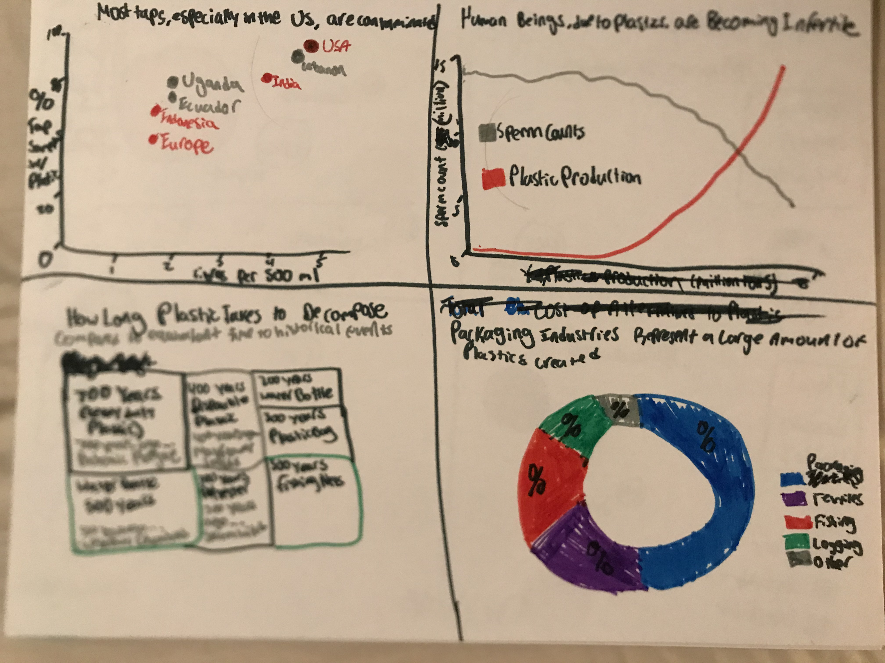

# Final Project

## Outline

### Quick Summary

  Plastic pollution can potentially be the largest environmental threat after climate change. There's a lot of risks and very little being done. 

-Microplastics, little tiny plastic fibers, exist everywhere- our tap water, our food, and in nature. 
  -There's so much microplastics that it actually begins to accumulate in our cells. We don't really know what the health effects of    this look like when we give it enough time, but what we do know is that plastic accumulation disrupts endocrine systems(specifically lowers testosterone and sperm count in men) and increases the risk of cancer.
- Current Trajectories if we do not solve the issue. 
-Plastic, since its a man-made substance, takes centuries to completely decompose. 
  - This problem will be around for a long time
-The problem is only getting worse- every year, we are increasing our plastic production
  - A few select countries pollute much more per capita than others
-Potential fixes?
  - Simple- stop producing plastics
    -Alternatives
  - To the plastic we've already created?
    -Lake/Ocean cleanups
    -Buffing up water purification systems

The story I want to give is one of alarm, but I supply the roadmap to the way that eliminates the problem. The goal is general awareness, as I feel many assume the only reason to stop plastic pollution is because it looks dirty. The story starts low and slowly climbs its way back up, but never reaches an actual happy place - there's not too much to be overjoyed about in this situation. 

### Initial Sketches

The initial story point I want the reader to get is the first sketch- that microplastics contaminate most public water supplies. I want to drive home to severity of the problem with the sperm count graph, furthering urgency. Also, the graph on how long plastic takes to decompose should further the necessity to stop its use. Lastly, as per these sketches, I want to talk about which industries use the most plastic. A visualization I wish to add is one detailing the cost of alternatives (such as reusable steel, disposable hemp/wool, etc) but am still considering ways to go about this! 

### The Data

Much of my data will come from the following source- https://ourworldindata.org/plastic-pollution

This website, ourworldindata.org, has a pretty impressive database that tracks plastic pollution and important metrics in the fight against it. It includes numerous sets of data regarding its production, who mismanages the disposal of plastic, who produces the most plastic per capita, and much more. They provide data in charts, maps, and (most importantly) they provide the .csv for all of their databases. If I eventually decide that I wish to switch up what datasets I wish to use to create my story, it will be easy to find another one simply through the list provided! 

Though most of my data will come from ourworldindata.org, the data on contaminated drinking water comes from this article by the guardian- https://www.theguardian.com/environment/2017/sep/06/plastic-fibres-found-tap-water-around-world-study-reveals

This data is one of the main focal points I want to make, which is how widespread the data is. Unfortunately, I will likely have to recreate the data in excel as there is no .csv included. Nonetheless, the small amount of data I'll need to input will be a plus. Since this data is so important to my story, I intend on keeping it. 

### Method and Medium

I plan on completing this final project through Shorthand. After weighing all of my options pretty carefully, I plan on going with the option that I feel is safest. Obviously I am most familiar with powerpoint, but this medium could allow me to use some bad habits as a crutch and is, overall, not very engaging. Certainly, it would also not be the most appealing to employers as well. From what I have heard in class, shorthand is the most common medium that students choose. I feel it may be best to follow the pack here! Furthermore, Shorthand looks intuitive and, my favorite part, requires no coding! Other mentioned media, such as VR, video, and as mentioned in class "interpretive dance" all seem like fun and novel opportunities. Unfortunately, none of these fit my strengths! 

Besides shorthand, I plan on creating most of my charts in Tableau. I've enjoyed learning about Tableau throughout the course and feel I'm getting a good handle on it. Some visualizations I'm hoping to create may need to be created outside of Tableau, I'm not sure yet. Particularly, in regards to how long plastic takes to decompose, I feel a pictograph (indicating that 1 water bottle = 1 century, per say) would actually be a good way of building the data up. I may also take another look at flourish if I need something simple done! 

I'm excited to dive further into Shorthand. After seeing presentations in the beginning of class, I'm eager to see what I can make with the system. I'm anxious about how much I need to learn about the platform in a short amount of time, but I'm hoping the selling point of it being "easy to learn" will ring true. 

I will further study all data that is offered on ourworldindata.org and also look into more data to make sure I'm making the strongest case possible. A professor of mine from my undergraduate career has done much of the original research discovering how widespread microplastics were, so contacting her would not be a poor idea (or even just using her research!). Besides this, I will be involved in writing my script, timing my presentation, and learning as much as I can in the process! 

 
